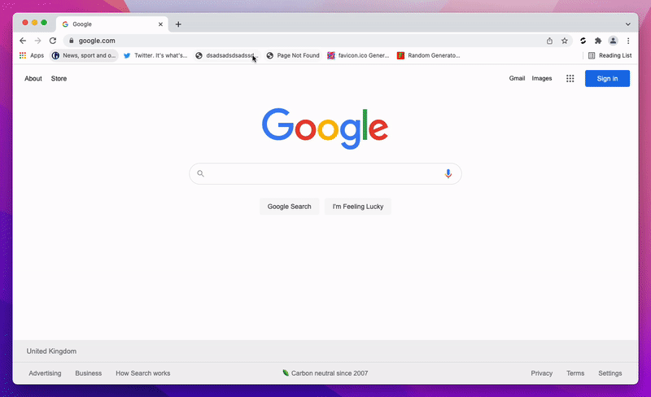

# Remarkable

Remarkable is a simple extension that automatically keeps your bookmarks clean & up-to-date.

## Installation

*(Other browsers coming soon - sorry!)*

## Usage

### Clean bookmarks

Running a clean will move all dead sites (e.g. non-existent pages, 404s) to a trash folder for you to review or delete.

### Refresh bookmarks

Running a refresh will update your bookmarks to use the most recent favicon and title for each page.

During the refresh, all your bookmarks will be open (in small batches), so the process can be a bit slow if you have a large number of bookmarks.

## Settings

...

## Privacy

Remarkable doesn't store any data at all.
